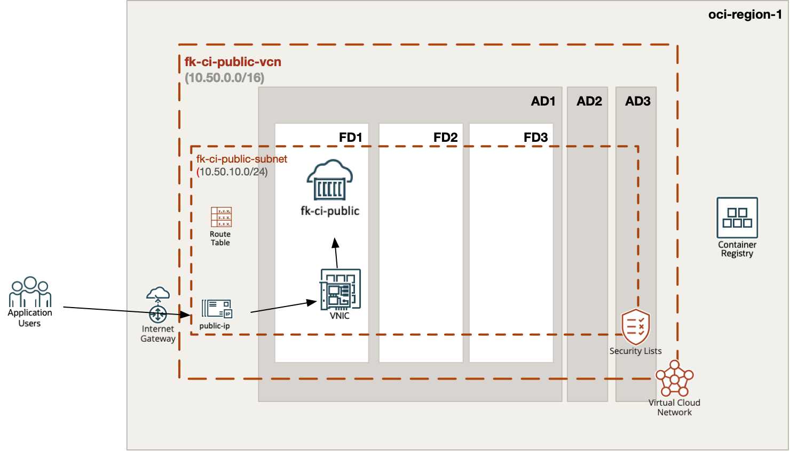
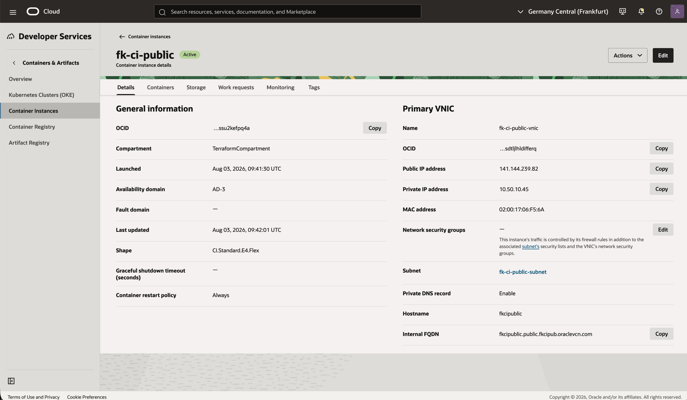
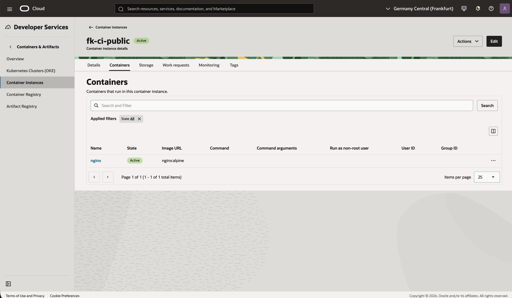
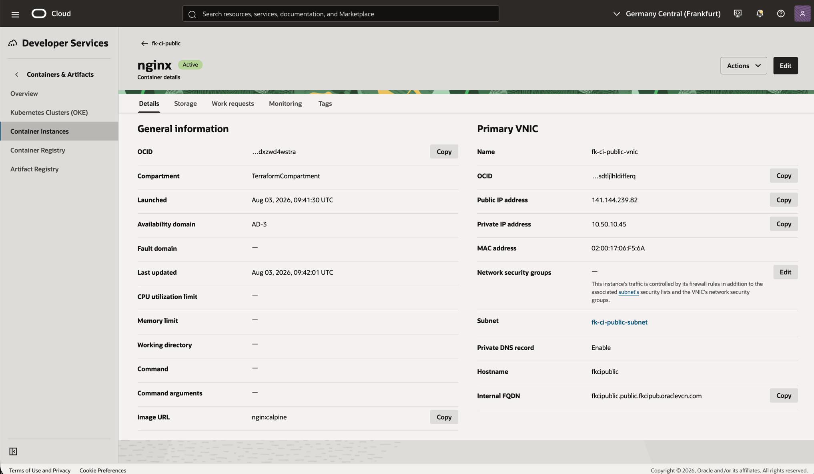
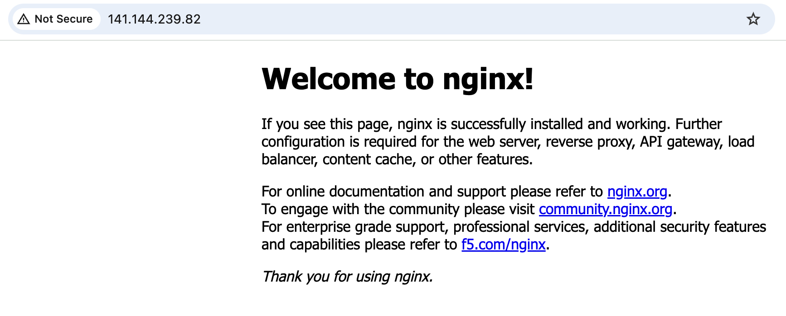

# Example 01: Public OCI Container Instance

In this first container instance example, we deploy a **single Oracle Cloud Infrastructure (OCI) Container Instance** using **Terraform/OpenTofu**.
The container instance is launched into a **public subnet** created by the networking module and runs the public `nginx:alpine` image from Docker Hub.

This example is intentionally simple and focuses on the **direct public container instance deployment path**, without private registry access or load balancer integration.

---

## Architecture Overview



This deployment creates:

- A dedicated **VCN** and one **public subnet** using `terraform-oci-fk-vcn`
- One **OCI Container Instance** using this module
- One **public IP** assigned on the container instance VNIC
- One `nginx:alpine` container with an HTTP health check on port `80`

This is the most direct way to understand how the container instance module behaves with a public VNIC.

---

## Deployment Steps

Create a local variables file:

```bash
cp terraform.tfvars.example terraform.tfvars
```

Then initialize and apply the OpenTofu configuration:

```bash
tofu init
tofu plan
tofu apply
```

After a successful deployment, OpenTofu will output:

- The container instance ID
- The private IP
- The public IP
- The VCN ID

---

## Runtime Notes

After deployment, the container instance should:

- have a public IP on the primary VNIC
- pull `nginx:alpine` from Docker Hub
- expose HTTP on port `80`
- report a healthy HTTP check from OCI Container Instances

---

## OCI Console And Runtime Verification

### Container Instance Status



This view confirms that the container instance is deployed successfully and runs in the expected compartment, availability domain, and shape.
It also shows the primary VNIC, public IP, private IP, and public subnet attachment.

### Container Status



This view confirms that the `nginx` container is active and uses the `nginx:alpine` image.

### Network View



This view confirms the primary VNIC configuration, including the public IP, private IP, hostname, and subnet attachment.

### HTTP Access



This runtime verification confirms that the public IP is reachable over HTTP and returns the default NGINX page.

---

## Cleanup

To remove all resources created by this example:

```bash
tofu destroy
```

---

## Summary

This example demonstrates:

- How to deploy a **public OCI Container Instance** using Terraform/OpenTofu
- How to combine the module with `terraform-oci-fk-vcn`
- How to run a public container image without registry credentials
- How to expose a simple HTTP container directly through a public VNIC

---

## Learn More

Visit [FoggyKitchen.com](https://foggykitchen.com/) for OCI, multicloud, and Terraform/OpenTofu learning resources.

---

## License

Licensed under the **Universal Permissive License (UPL), Version 1.0**.
See [LICENSE](../../LICENSE) for more details.

---

© 2026 [FoggyKitchen.com](https://foggykitchen.com) - Cloud. Code. Clarity.
