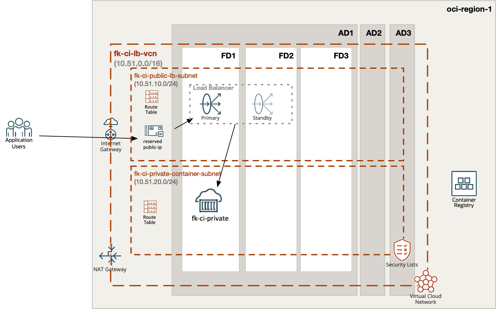
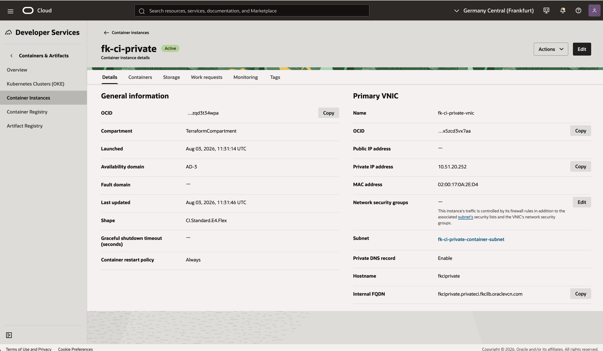
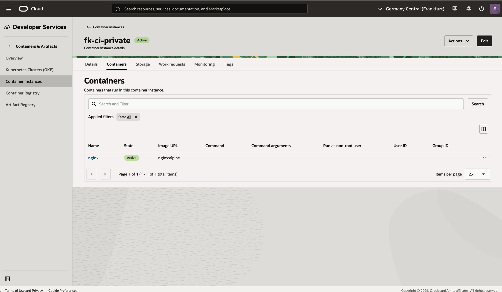
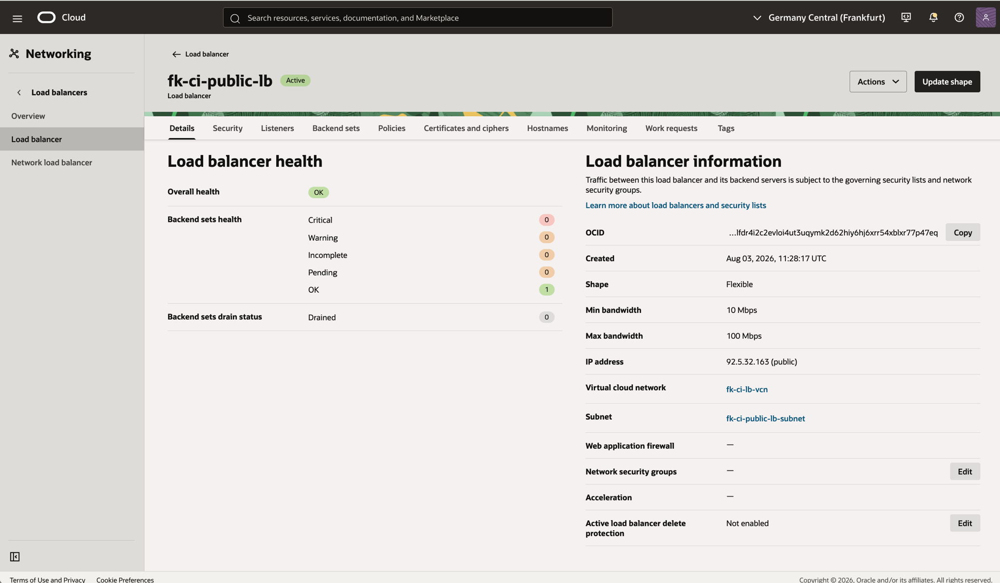
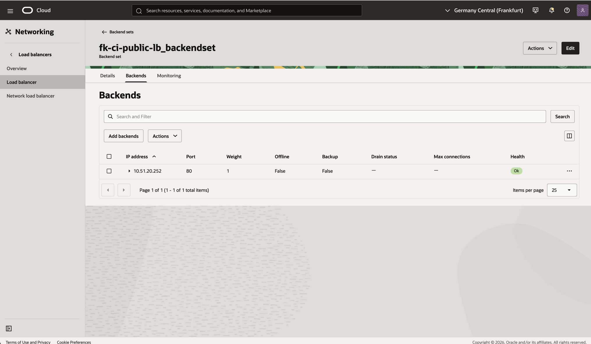
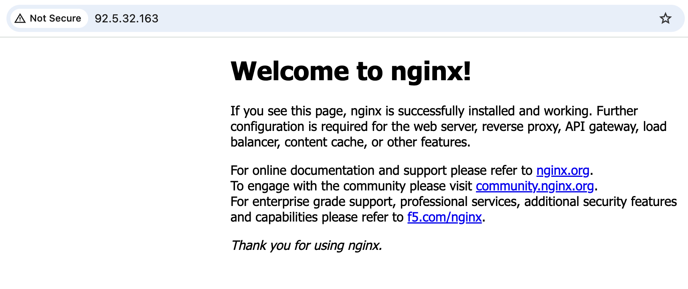

# Example 02: Private OCI Container Instance with Load Balancer

In this second container instance example, we deploy a **private Oracle Cloud Infrastructure (OCI) Container Instance** behind a **public OCI Load Balancer** using **Terraform/OpenTofu**.

The container instance has no public IP. Internet-facing traffic lands on the load balancer and is forwarded to the container instance over private VCN addressing.

---

## Architecture Overview



This deployment creates:

- A dedicated **VCN** with public and private subnets using `terraform-oci-fk-vcn`
- A reserved **Public IP** using `terraform-oci-fk-public-ip`
- A **public Load Balancer** using `terraform-oci-fk-loadbalancer`
- One **private OCI Container Instance** using this module
- A static load balancer backend pointing to the container instance private IP
- A NAT route for outbound image pull traffic from the private subnet

This pattern is the recommended next step after the public VNIC example because it separates ingress from runtime placement.

---

## Deployment Steps

Create a local variables file:

```bash
cp terraform.tfvars.example terraform.tfvars
```

Then initialize and apply the OpenTofu configuration:

```bash
tofu init
tofu plan
tofu apply
```

After a successful deployment, OpenTofu will output:

- The container instance ID
- The private container IP
- The reserved public IP
- The public load balancer IP
- The backend set name

---

## Runtime Notes

After deployment:

- the container instance should remain private
- the container image is pulled through the NAT path
- the load balancer should use the reserved public IP created by `terraform-oci-fk-public-ip`
- the load balancer should report the backend as healthy
- HTTP traffic to the public load balancer IP should reach the container

---

## OCI Console And Runtime Verification

### Container Instance Status



This view confirms that the container instance is active, attached to the private subnet, and has no public IP address on its primary VNIC.

### Container Status



This view confirms that the `nginx` container is active and uses the `nginx:alpine` image.

### Load Balancer Status



This view confirms that the public load balancer is active, uses the reserved public IP, and reports overall health as `OK`.

### Backend Health



This view confirms that the load balancer backend points to the private container IP on port `80` and reports health as `Ok`.

### HTTP Access



This runtime verification confirms that HTTP traffic to the load balancer public IP reaches the private `nginx` container.

---

## Cleanup

To remove all resources created by this example:

```bash
tofu destroy
```

---

## Summary

This example demonstrates:

- How to deploy a **private OCI Container Instance**
- How to combine the module with `terraform-oci-fk-vcn`
- How to model public frontend identity with `terraform-oci-fk-public-ip`
- How to expose the container through `terraform-oci-fk-loadbalancer`
- How to avoid direct public addressing on the container runtime

---

## Learn More

Visit [FoggyKitchen.com](https://foggykitchen.com/) for OCI, multicloud, and Terraform/OpenTofu learning resources.

---

## License

Licensed under the **Universal Permissive License (UPL), Version 1.0**.
See [LICENSE](../../LICENSE) for more details.

---

© 2026 [FoggyKitchen.com](https://foggykitchen.com) - Cloud. Code. Clarity.
