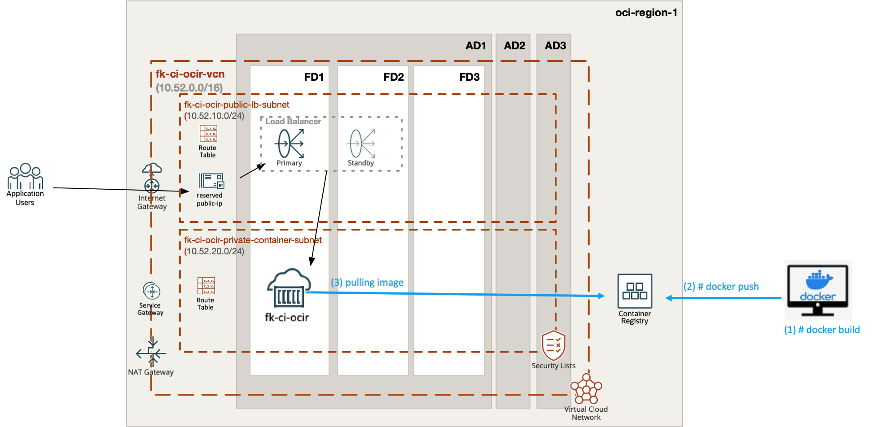
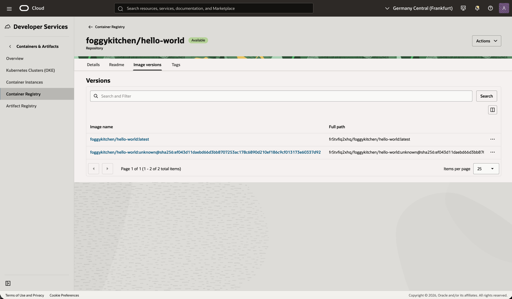
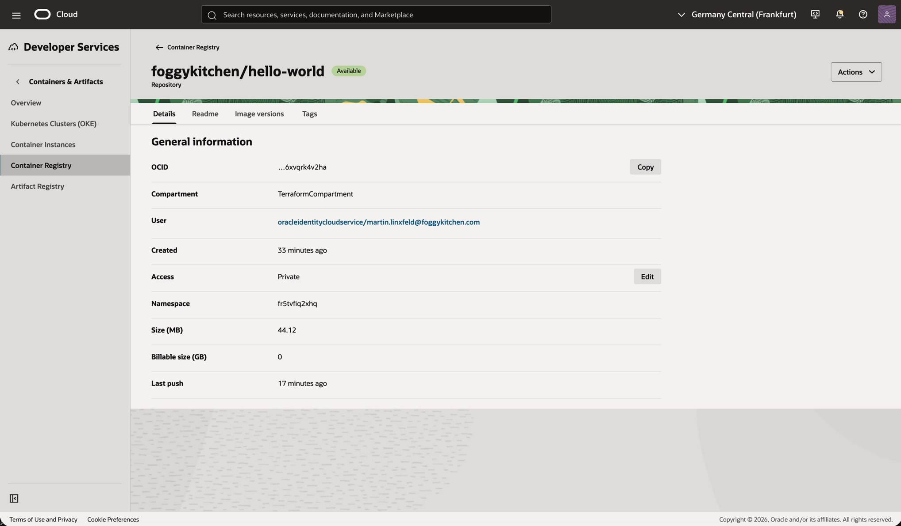
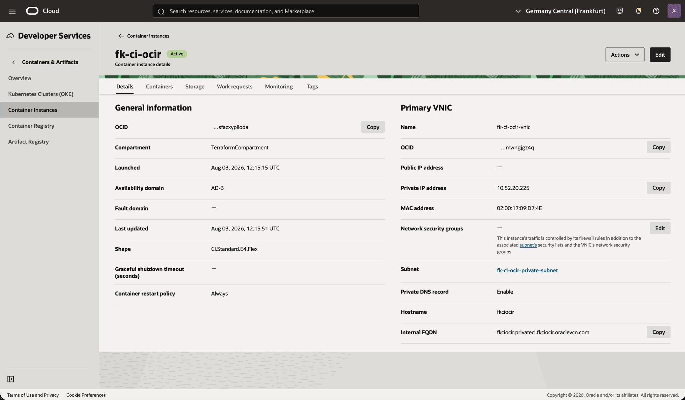
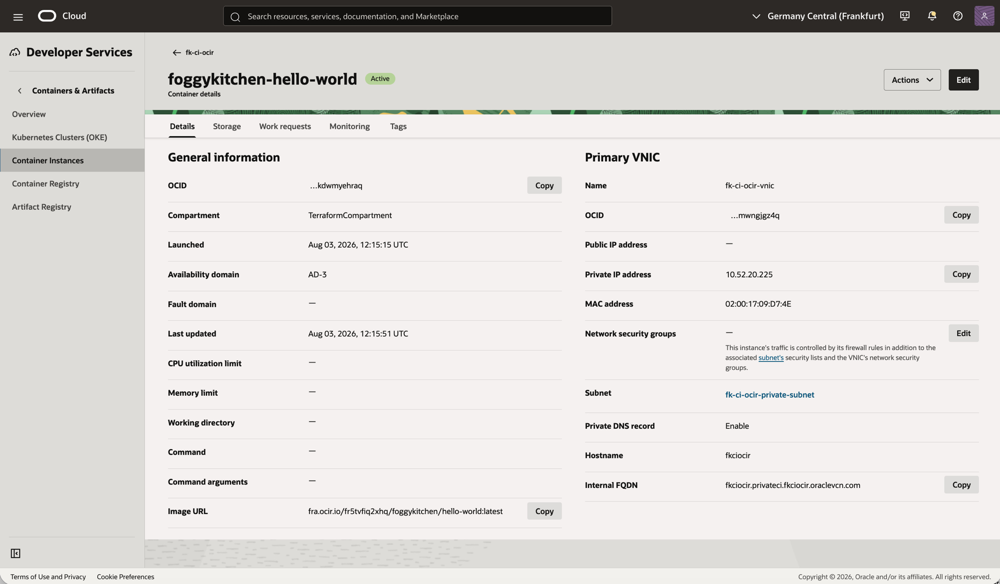
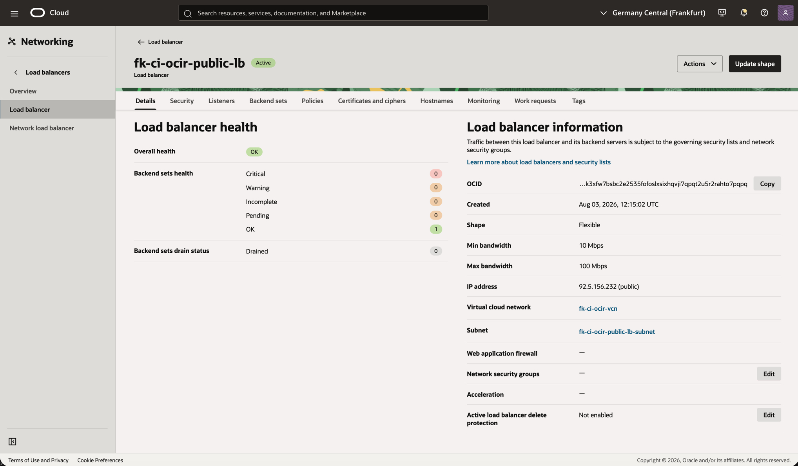
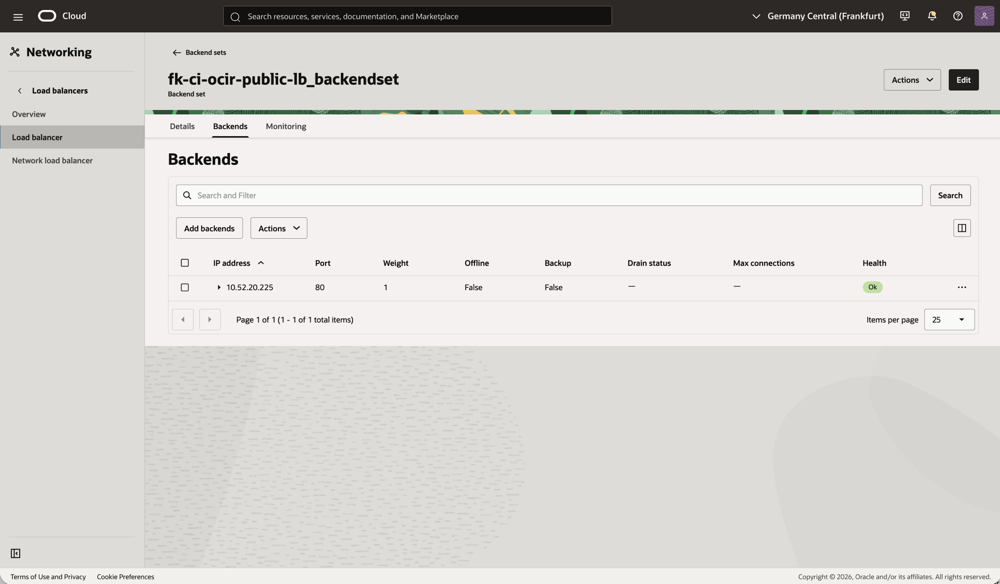
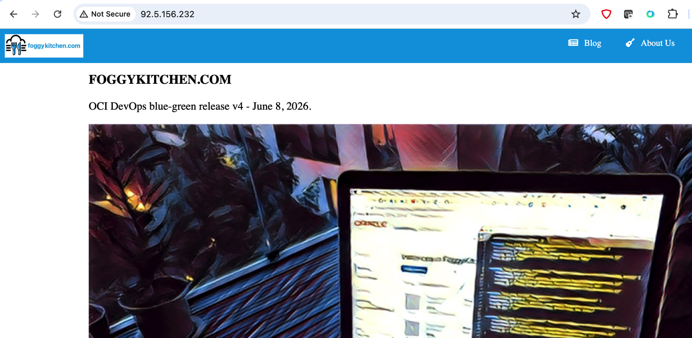

# Example 03: OCI Container Instance with FoggyKitchen Hello World from OCIR

In this third container instance example, we deploy an **OCI Container Instance** using the **[foggykitchen-hello-world](https://github.com/foggykitchen/foggykitchen-hello-world)** application image stored in **Oracle Cloud Infrastructure Registry (OCIR)**.

The OCIR repository is created by `terraform-oci-fk-ocir`, the network paths are created by `terraform-oci-fk-vcn`, the public frontend is created by `terraform-oci-fk-public-ip` and `terraform-oci-fk-loadbalancer`, and the container runtime is created by this module.

---

## Architecture Overview



This deployment creates:

- A dedicated **VCN** with public and private subnets using `terraform-oci-fk-vcn`
- NAT and Service Gateway paths for private outbound access
- A private **OCIR repository** using `terraform-oci-fk-ocir`
- A local build-and-push workflow for `foggykitchen-hello-world`
- A reserved **Public IP** using `terraform-oci-fk-public-ip`
- A public **Load Balancer** using `terraform-oci-fk-loadbalancer`
- One private **OCI Container Instance** using this module
- One `foggykitchen-hello-world` container image pulled from OCIR
- A BASIC image pull secret using base64-encoded OCIR credentials

This example focuses on private registry integration while keeping the container runtime private and exposing the application through a public load balancer.

---

## Image Build And Push

This example adapts the build-and-push pattern used by `terraform-oci-fk-function`.
During `tofu apply`, OpenTofu runs a local build workflow that:

- logs in to OCIR
- clones `foggykitchen-hello-world`
- builds the Docker image for `linux/amd64`
- tags it as `module.ocir.image_prefix:image_tag`
- pushes the image to OCIR before the container instance is created

The default source repository is:

```bash
https://github.com/foggykitchen/foggykitchen-hello-world.git
```

The build source is cloned into `.terraform/foggykitchen-hello-world`, which keeps generated files outside the repository source tree.

Set `build_and_push_image = false` if the image already exists in OCIR and you only want to deploy the container instance.

To force a rebuild without changing the image tag, change `hello_world_source_hash` in `terraform.tfvars`.

Docker must be installed and running on the workstation where `tofu apply` is executed.
The default `docker_platform` is `linux/amd64`, which matches the `CI.Standard.E4.Flex` container instance shape used by this example.

You can also run only the build-and-push step:

```bash
tofu apply -target=terraform_data.hello_world_build_push
```

---

## Deployment Steps

Create a local variables file:

```bash
cp terraform.tfvars.example terraform.tfvars
```

Then initialize and apply the OpenTofu configuration:

```bash
tofu init
tofu plan
tofu apply
```

Required variables:

- `ocir_username`, usually in `namespace/username` format
- `ocir_auth_token`, an OCI auth token used for OCIR pulls

For compatibility with older FoggyKitchen function training variables, this example also accepts `ocir_user_name` and `ocir_user_password`.

Optional build variables:

- `build_and_push_image`
- `docker_platform`
- `hello_world_repo_url`
- `hello_world_repo_ref`
- `hello_world_source_hash`

---

## Runtime Notes

After deployment:

- the OCIR repository should exist
- the local build step should push `foggykitchen-hello-world` to OCIR
- the container instance should remain private
- the `foggykitchen-hello-world` image should be pulled through the private outbound path
- the load balancer should use the reserved public IP created by `terraform-oci-fk-public-ip`
- HTTP traffic to the public load balancer IP should reach the private container
- no raw OCI resources are used in the example configuration

---

## OCI Console And Runtime Verification

### OCIR Repository Versions



This view confirms that the `foggykitchen/hello-world` repository exists and contains the `latest` image tag used by the container instance.

### OCIR Repository Details



This view confirms that the OCIR repository is private, belongs to the expected namespace, and has a recent image push.

### Container Instance Status



This view confirms that the container instance is active, attached to the private subnet, and has no public IP address on its primary VNIC.

### Container Status



This view confirms that the `foggykitchen-hello-world` container is active and uses the OCIR image URL.

### Load Balancer Status



This view confirms that the public load balancer is active, uses the reserved public IP, and reports overall health as `OK`.

### Backend Health



This view confirms that the load balancer backend points to the private container IP on port `80` and reports health as `Ok`.

### HTTP Access



This runtime verification confirms that HTTP traffic to the load balancer public IP reaches the private `foggykitchen-hello-world` container.

---

## Cleanup

To remove all resources created by this example:

```bash
tofu destroy
```

---

## Summary

This example demonstrates:

- How to deploy `foggykitchen-hello-world` as an OCI Container Instance from a private OCIR image
- How to combine this module with `terraform-oci-fk-vcn`
- How to create the registry with `terraform-oci-fk-ocir`
- How to model public frontend identity with `terraform-oci-fk-public-ip`
- How to expose the private container through `terraform-oci-fk-loadbalancer`
- How to adapt the FoggyKitchen Function build-and-push pattern for OCI Container Instances
- How to use BASIC image pull secrets without embedding raw OCI resources in the example

---

## Learn More

Visit [FoggyKitchen.com](https://foggykitchen.com/) for OCI, multicloud, and Terraform/OpenTofu learning resources.

---

## License

Licensed under the **Universal Permissive License (UPL), Version 1.0**.
See [LICENSE](../../LICENSE) for more details.

---

© 2026 [FoggyKitchen.com](https://foggykitchen.com) - Cloud. Code. Clarity.
